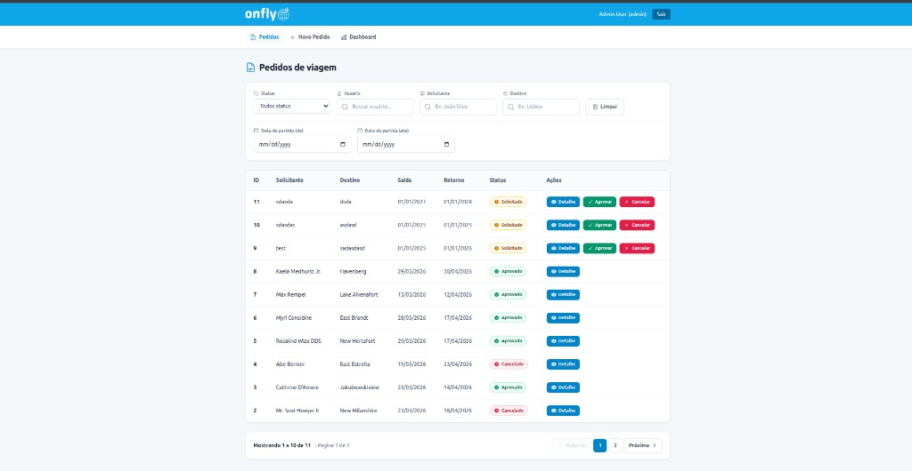
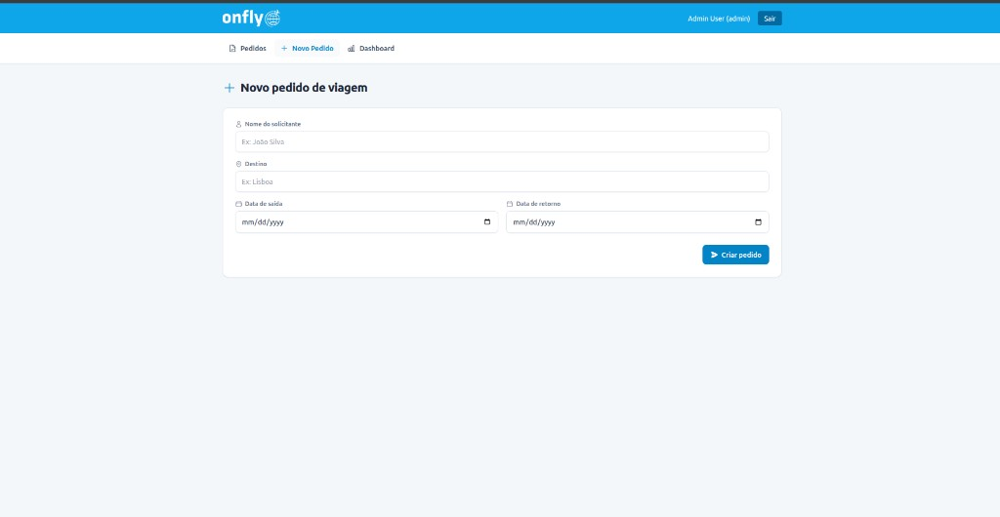
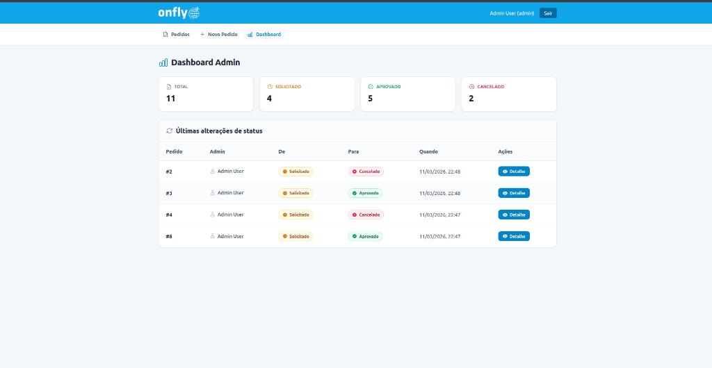

# Travel Orders

Aplicação full stack para gerenciamento de pedidos de viagem corporativa. Usuários criam pedidos de viagem; administradores aprovam ou cancelam. API REST consumida por SPA Vue 3.

## Stack

**Backend**
- Laravel 12, PHP 8.3
- Laravel Sanctum (autenticação por token)
- Spatie Laravel Permission (roles: `admin`, `user`)
- Redis (cache)
- MySQL 8.4
- PHPUnit (testes com SQLite em memória)
- L5-Swagger (documentação OpenAPI)

**Frontend**
- Vue 3, Vite, Pinia, Vue Router
- Axios (interceptor Bearer)
- Tailwind CSS, Headless UI, Heroicons
- Vue Toastification

**Infra**
- Docker Compose: PHP-FPM, Nginx, MySQL, Redis
- Frontend roda localmente com Node (Vite proxy para API)

## Estrutura do projeto

```
travel-orders/
├── backend/          # API Laravel
├── frontend/         # SPA Vue 3
├── docker/           # Dockerfiles e configs (nginx, php, mysql)
├── docs/images/      # Screenshots da interface
├── docker-compose.yml
└── README.md
```

## Interface do sistema

### Login

Tela de autenticação com campos de e-mail e senha. Layout dividido: imagem de fundo à esquerda e formulário à direita com logo onfly.


### Listagem de pedidos

Página principal de pedidos com filtros (status, usuário, solicitante, destino, datas), tabela com colunas ID, Solicitante, Destino, Saída, Retorno, Status e Ações. Admin vê botões Aprovar/Cancelar em pedidos solicitados; paginação na parte inferior.



### Novo pedido

Formulário para criar pedido: nome do solicitante, destino, data de saída e data de retorno. Validação em português; data de saída não pode ser anterior a hoje; data de retorno deve ser igual ou posterior à de saída.



### Dashboard (admin)

Visão geral com cards de totais (Total, Solicitado, Aprovado, Cancelado) e tabela das últimas alterações de status com colunas Pedido, Admin, De, Para, Quando e Ações (botão Detalhe).



## Como rodar o sistema

### Com Docker (recomendado)

1. Na raiz do projeto:
   ```bash
   cd travel-orders
   cp backend/.env.example backend/.env
   docker compose up -d --build
   ```

2. Instalar dependências e configurar o backend:
   ```bash
   docker compose exec app composer install
   docker compose exec app php artisan key:generate
   docker compose exec app php artisan migrate --seed
   ```

3. Rodar o frontend (na máquina local):
   ```bash
   cd frontend
   npm install
   npm run dev
   ```

- **Backend:** http://localhost:8080  
- **Frontend:** http://localhost:5173  
- O Vite faz proxy de `/api` para `http://localhost:8080`

### Backend sem Docker

```bash
cd backend
cp .env.example .env
composer install
php artisan key:generate
# Ajuste DB_* no .env para seu MySQL
php artisan migrate --seed
php artisan serve
```

### Frontend

O frontend sempre roda localmente. O `.env` do frontend pode ter `VITE_API_BASE_URL` se a API estiver em outra URL. Por padrão o proxy do Vite usa `http://localhost:8080`.

```bash
cd frontend
npm install
npm run dev
```

Build para produção: `npm run build`

## Variáveis de ambiente (backend)

Em `backend/.env`:

| Variável | Descrição |
|----------|------------|
| `APP_URL` | URL do backend (ex: `http://localhost:8080`) |
| `DB_CONNECTION`, `DB_HOST`, `DB_DATABASE`, `DB_USERNAME`, `DB_PASSWORD` | Conexão MySQL |
| `CACHE_STORE` | `redis` em produção, `array` em testes |
| `REDIS_HOST`, `REDIS_PORT` | Redis |
| `L5_SWAGGER_CONST_HOST` | URL para Swagger UI |

## Testes

Os testes usam SQLite em memória (`:memory:`), configurado em `phpunit.xml`.

**Localmente:**
```bash
cd backend
php artisan test
```

**No Docker:**
```bash
docker compose exec app php artisan test
```

**Teste específico:**
```bash
php artisan test --filter=TravelOrderApiTest
```

## Migrations e seeders

```bash
php artisan migrate
php artisan db:seed
php artisan migrate:fresh --seed   # reset completo
```

## Swagger (documentação da API)

- Gerar OpenAPI: `php artisan l5-swagger:generate`
- UI: http://localhost:8080/api/documentation (requer login como admin)
- Autenticação: Bearer token no header ou `?token=SEU_TOKEN` na URL
- Especificação: `backend/app/OpenApi/OpenApiSpec.php`

## Credenciais (seed)

| Role | Email | Senha |
|------|-------|-------|
| Admin | admin@travelorders.test | password |
| Usuário | user@travelorders.test | password |

## Funcionalidades

### Autenticação
- Login via `POST /api/auth/login` (retorna token)
- Logout e `GET /api/auth/me` com Bearer token

### Pedidos de viagem
- **Criar:** nome do solicitante, destino, data de saída, data de retorno
- **Validações:** data de saída ≥ hoje; data de retorno ≥ data de saída; nome 3–120 chars; destino 2–120 chars
- **Status:** `requested` → `approved` ou `cancelled` (apenas admin; aprovado não pode ser cancelado)

### Permissões
- **User:** vê e cria apenas seus pedidos
- **Admin:** vê todos, aprova/cancela, dashboard, logs de status, lista usuários

### API – principais endpoints

| Método | Endpoint | Descrição |
|--------|----------|-----------|
| POST | `/api/auth/login` | Login |
| POST | `/api/auth/logout` | Logout |
| GET | `/api/auth/me` | Usuário autenticado |
| GET | `/api/users` | Lista usuários (admin) |
| GET | `/api/travel-orders` | Lista pedidos (com filtros) |
| POST | `/api/travel-orders` | Criar pedido |
| GET | `/api/travel-orders/{id}` | Detalhe do pedido |
| PATCH | `/api/travel-orders/{id}/status` | Atualizar status (admin) |
| GET | `/api/travel-orders/dashboard` | Contadores (admin) |
| GET | `/api/travel-orders/status-logs` | Logs de mudança de status (admin) |

**Filtros na listagem:** `status`, `destination`, `requester_name`, `user_id` (admin), `departure_from`, `departure_to`, `page`, `per_page`

## Frontend – páginas e recursos

- **Login** – autenticação com token
- **Pedidos** – listagem com filtros, paginação, busca
- **Novo pedido** – formulário com validação em português
- **Detalhe do pedido** – visualização e ações (admin)
- **Dashboard** – totais por status (admin)
- Rotas protegidas por autenticação e role admin
- Mensagens de validação em português; erros genéricos padronizados
