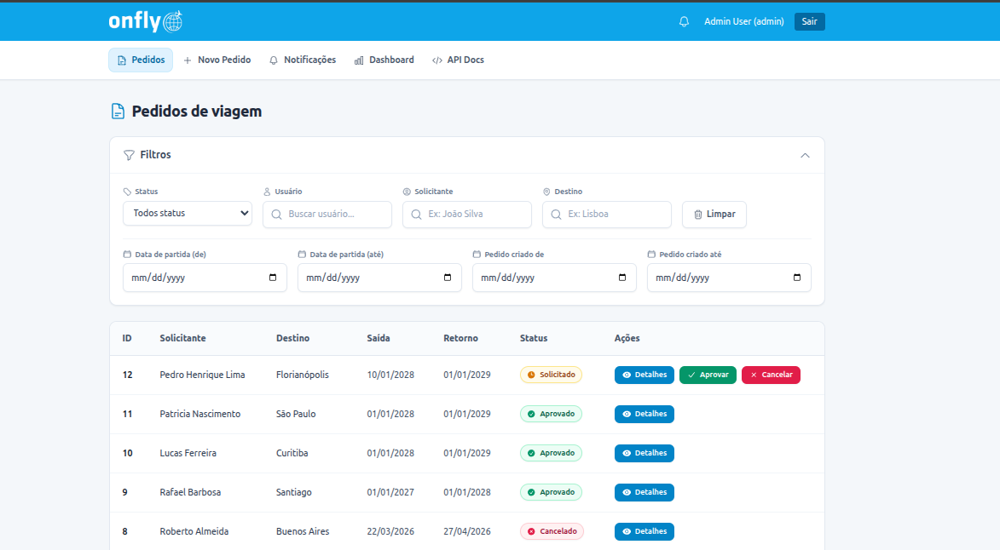
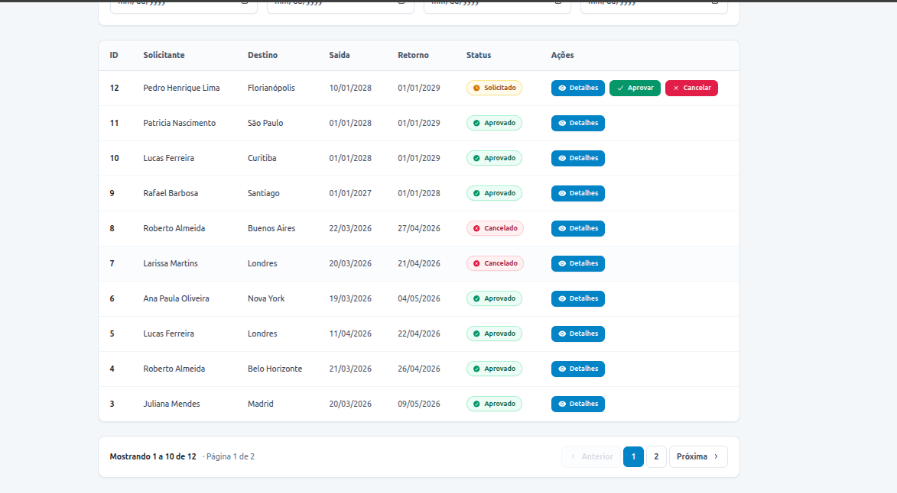
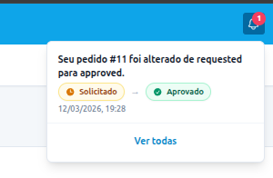
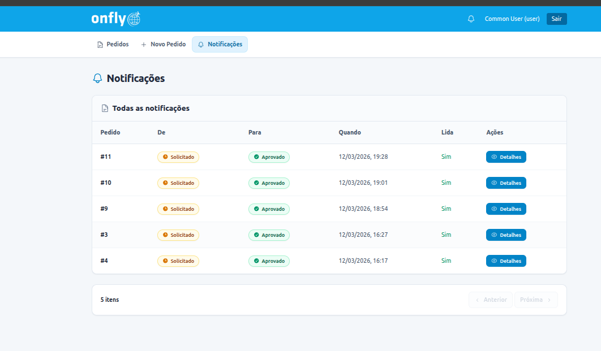
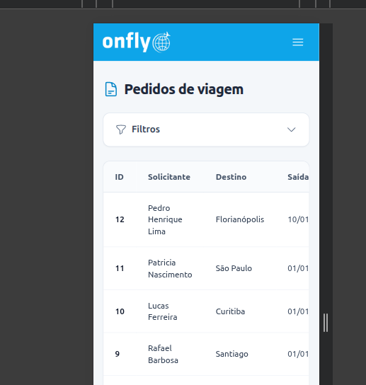
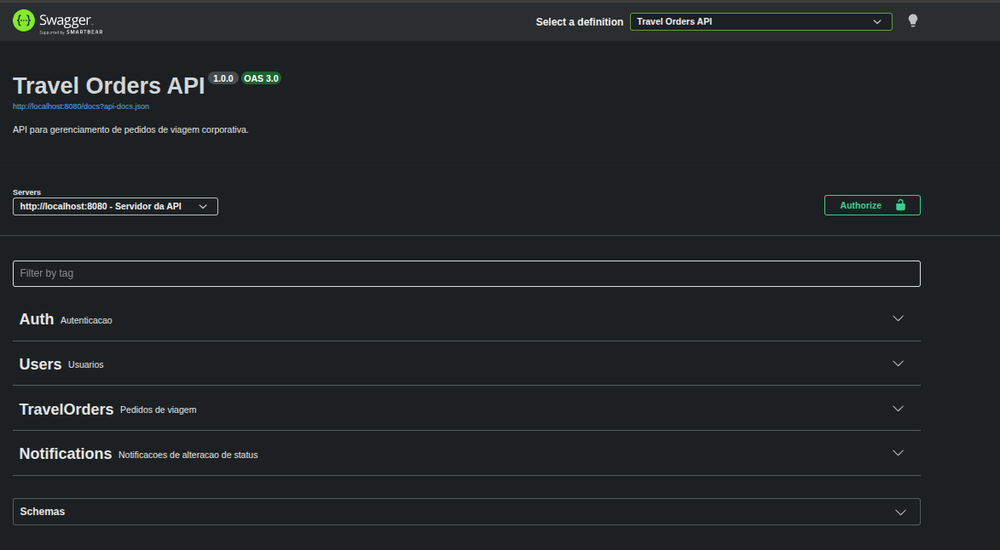

# Travel Orders

Aplicação full stack para gerenciamento de pedidos de viagem corporativa. Usuários criam pedidos; administradores aprovam ou cancelam. API REST consumida por SPA Vue 3 com autenticação via Laravel Sanctum.

## Stack

| Camada | Tecnologias |
|--------|-------------|
| **Backend** | Laravel 12, PHP 8.3, Sanctum, Spatie Permission, Redis, MySQL 8.4, L5-Swagger |
| **Frontend** | Vue 3, Vite, Pinia, Vue Router, Tailwind CSS, Headless UI, Heroicons, Vue Toastification |
| **Infra** | Docker Compose (PHP-FPM, Nginx, MySQL, Redis) |

## Interface

### Listagem de pedidos

Página principal com filtros colapsáveis (status, usuário, solicitante, destino, datas de partida e criação), tabela paginada e ações de aprovar/cancelar para admin. Polling silencioso a cada 15s para atualização em background.





### Novo pedido

Formulário com validação em português: nome do solicitante, destino, data de saída e retorno. Data de saída ≥ hoje; data de retorno ≥ data de saída.


### Dashboard (admin)

Cards com totais por status e tabela das últimas alterações de status com filtros.


### Notificações

Sino no header exibe contagem de não lidas; dropdown com preview e link para página completa. Polling de 15s para atualização do contador.





### Mobile

Menu hamburger em telas menores; filtros colapsáveis (abertos no desktop, fechados no mobile).



### Documentação da API (Swagger)

Disponível para admins em `/api/documentation`. Autenticação via Bearer token.



## Estrutura do projeto

```
travel-orders/
├── backend/          # API Laravel
├── frontend/         # SPA Vue 3
├── docker/           # Dockerfiles e configs
├── docs/images/      # Screenshots da interface
├── docker-compose.yml
└── README.md
```

## Como rodar

### Com Docker (recomendado)

```bash
cd travel-orders
cp backend/.env.example backend/.env
docker compose up -d --build

docker compose exec app composer install
docker compose exec app php artisan key:generate
docker compose exec app php artisan migrate --seed

cd frontend && npm install && npm run dev
```

- **Backend:** http://localhost:8080  
- **Frontend:** http://localhost:5173  
- **Swagger:** http://localhost:8080/api/documentation (admin)

### Sem Docker

```bash
cd backend
cp .env.example .env
composer install
php artisan key:generate
# Ajuste DB_* no .env
php artisan migrate --seed
php artisan serve

cd frontend
npm install
npm run dev
```

## Credenciais (seed)

| Role | Email | Senha |
|------|-------|-------|
| Admin | admin@admin.com | password |
| Usuário | user@user.com | password |

## Funcionalidades

### Autenticação
- Login via Sanctum (Bearer token)
- Rotas protegidas; admin com acesso a dashboard e logs

### Pedidos de viagem
- Criar, listar, consultar por ID
- Filtros: status, destino, solicitante, usuário (admin), datas de partida e criação
- Status: `requested` → `approved` ou `cancelled` (apenas admin; aprovado não pode ser cancelado)
- Notificação ao solicitante em aprovação/cancelamento

### Polling (MVP)
- Notificações: contagem de não lidas a cada 15s (só com aba visível)
- Lista de pedidos: refresh silencioso a cada 15s na página de pedidos

## API – principais endpoints

| Método | Endpoint | Descrição |
|--------|----------|-----------|
| POST | `/api/auth/login` | Login |
| POST | `/api/auth/logout` | Logout |
| GET | `/api/auth/me` | Usuário autenticado |
| GET | `/api/users` | Lista usuários (admin) |
| GET | `/api/travel-orders` | Lista pedidos (com filtros) |
| POST | `/api/travel-orders` | Criar pedido |
| GET | `/api/travel-orders/{id}` | Detalhes do pedido |
| PATCH | `/api/travel-orders/{id}/status` | Atualizar status (admin) |
| GET | `/api/travel-orders/dashboard` | Contadores (admin) |
| GET | `/api/travel-orders/status-logs` | Logs de mudança (admin) |
| GET | `/api/notifications` | Lista notificações |
| GET | `/api/notifications/unread-count` | Contagem não lidas |

**Filtros na listagem de pedidos:** `status`, `destination`, `requester_name`, `user_id` (admin), `departure_from`, `departure_to`, `created_from`, `created_to`, `page`, `per_page`

## Testes

```bash
cd backend
php artisan test
# ou: docker compose exec app php artisan test
```

Testes usam SQLite em memória. Para teste específico: `php artisan test --filter=TravelOrderApiTest`

## Dados de exemplo

O seeder cria 15 pedidos com solicitantes e destinos realistas (ex.: João Silva, Maria Santos, São Paulo, Lisboa). Para atualizar pedidos existentes via Tinker:

```bash
php artisan tinker --execute="require base_path('database/scripts/update_travel_orders_realistic.php');"
```

## Variáveis de ambiente (backend)

| Variável | Descrição |
|----------|-----------|
| `APP_URL` | URL do backend |
| `DB_*` | Conexão MySQL |
| `CACHE_STORE` | `redis` em produção |
| `REDIS_HOST`, `REDIS_PORT` | Redis |
| `L5_SWAGGER_CONST_HOST` | URL para Swagger |
